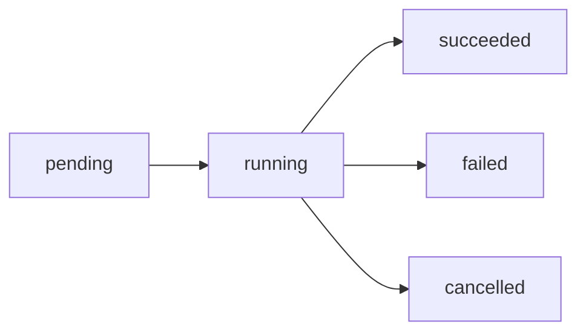

# Runs

A run is the execution of a work order. When you submit a work order, AgentGate creates a run to carry out the task. Runs track progress, status, and results.

## What Is a Run

Each work order creates exactly one run. The run represents the entire execution lifecycle:

- Workspace setup
- AI agent execution
- Iteration and verification cycles
- Result generation

## Run Lifecycle

Runs progress through these states:



### Run States

| State | Description | Terminal |
|-------|-------------|----------|
| `pending` | Queued, waiting to start | No |
| `running` | Currently executing | No |
| `succeeded` | Completed successfully | Yes |
| `failed` | Completed with failure | Yes |
| `cancelled` | Stopped by user request | Yes |

<Info>
  Terminal states are final—the run will not change state again.
</Info>

### State Transitions

- **pending → running**: Run starts execution
- **running → succeeded**: All iterations passed verification
- **running → failed**: Max iterations reached without success, or unrecoverable error
- **running → cancelled**: User requested cancellation

## Monitoring Runs

### Polling

Retrieve run status by ID:

```bash
curl https://api.agentgate.mynewapi.com/v1/runs/run_abc123 \
  -H "Authorization: Bearer YOUR_API_KEY"
```

<Warning>
  Polling creates API load. For production, use webhooks instead.
</Warning>

### Webhooks (Recommended)

Configure webhooks to receive real-time notifications:

```json
{
  "url": "https://your-app.com/webhooks/agentgate",
  "events": ["run.completed", "run.failed"]
}
```

See [Webhooks](/b2b/webhooks) for setup instructions.

## Run Results

When a run completes successfully, results include:

```json
{
  "id": "run_abc123",
  "workOrderId": "wo_xyz789",
  "status": "succeeded",
  "iterations": 3,
  "prUrl": "https://github.com/your-org/repo/pull/42",
  "timing": {
    "startedAt": "2024-01-15T10:30:00Z",
    "completedAt": "2024-01-15T10:35:00Z",
    "durationMs": 300000
  },
  "cost": {
    "credits": 150
  },
  "tenantContext": {
    "tenantId": "tenant_123",
    "tenantUserId": "user_456"
  }
}
```

### Result Fields

| Field | Description |
|-------|-------------|
| `id` | Run identifier |
| `workOrderId` | Associated work order |
| `status` | Final status |
| `iterations` | Number of iterations completed |
| `prUrl` | Pull request URL (if changes were made) |
| `timing` | Start, end, and duration |
| `cost` | Credit cost of the run |
| `tenantContext` | Tenant info (if provided) |

## Run Timing

### Duration

Run duration depends on:

- Task complexity
- Workspace size
- Number of iterations needed
- Verification level

Typical runs complete in 1-10 minutes.

### Timeouts

Runs have a maximum execution time. If exceeded:

- Run status becomes `failed`
- Partial results may be available
- Credits are charged for completed iterations

## Cancelling Runs

Cancel a run that's in progress:

```bash
curl -X POST https://api.agentgate.mynewapi.com/v1/runs/run_abc123/cancel \
  -H "Authorization: Bearer YOUR_API_KEY"
```

<Note>
  Only runs in `pending` or `running` state can be cancelled.
</Note>

After cancellation:

- Run status becomes `cancelled`
- Any in-progress work stops
- Credits are charged for completed iterations only
- Webhook fires with `run.cancelled` event

## Cost Information

Run costs are determined by:

- Number of iterations
- Complexity of verification
- Workspace resources used

Check costs after completion in the run result or via the credits usage API.

## Listing Runs

Retrieve all runs with filtering:

```bash
curl "https://api.agentgate.mynewapi.com/v1/runs?status=succeeded&limit=10" \
  -H "Authorization: Bearer YOUR_API_KEY"
```

### Query Parameters

| Parameter | Description |
|-----------|-------------|
| `status` | Filter by status |
| `tenantUserId` | Filter by tenant user |
| `limit` | Results per page (max 100) |
| `offset` | Pagination offset |

## Related

<CardGroup cols={2}>
  <Card title="Work Orders" icon="file-lines" href="/concepts/work-orders">
    Learn about creating work orders
  </Card>
  <Card title="Iterations" icon="rotate" href="/concepts/iterations">
    Understand the iteration and verification process
  </Card>
</CardGroup>
